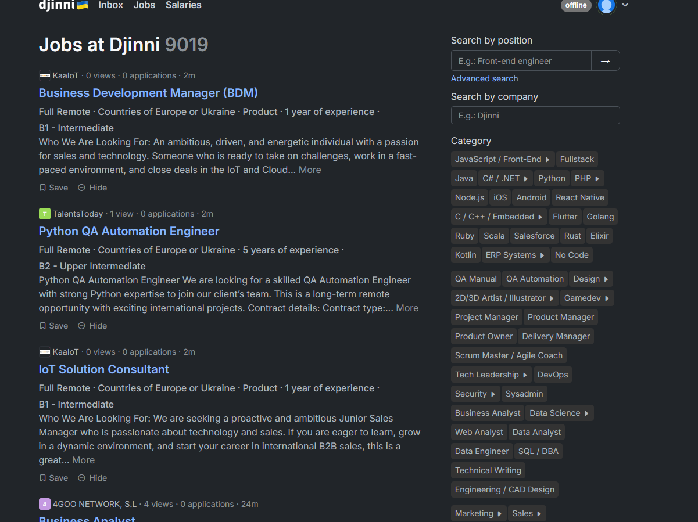
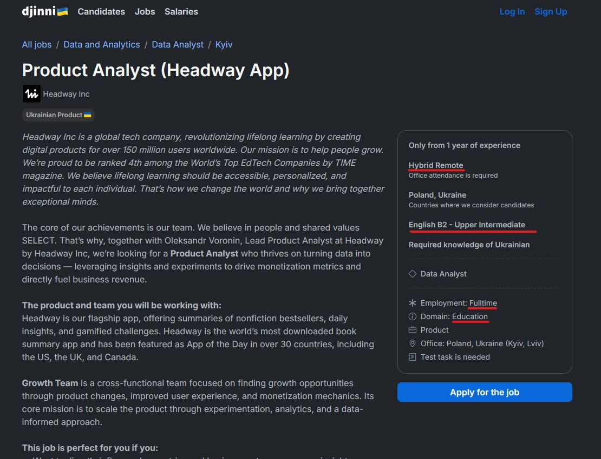
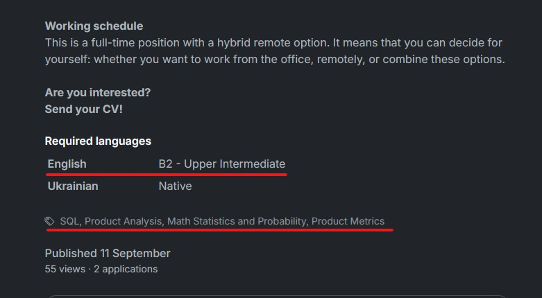

# Junior Data Analyst: Job-Market-Analysis

## A project aimed to analyze the Ukrainian job market for the requirements for Junior Data Analyst position

## Introduction

As a Junior Data Analyst currently looking for a job, the idea was simple: analyze the key skills Ukrainian companies ask for during the hiring process. I tried to find any data before building this project, but the search did not give anything.
That is when I decided to build it. Overall, the structure looks like this:

1. Choose a job aggregator from which the information will be scraped
2. Scrape information about jobs for desired position
3. Build a database out of scraped information
4. Build dashboards to explore the data

## Choosing the website

There are several rather large IT job aggregators in Ukraine. However, my choice fell onto [djinni](https://djinni.co/jobs/), because it seemed to contain the most currently available positions and was easy to scrape.

## Choosing relevant information

Now that we have chosen the website, let's explore it a bit to understand which information will be relevant for us to retrieve.

So the main page looks something like this, we can see different filters like category, salary, etc on the right. There, let's choose the **Data Analyst** as category and set the work experience to **No experience** and **1 year**. I'm choosing 1 year category even for junior data analysts as frequently the companies who set working experience to one year will still consider candidates with less than that.

Great, now we have the link to all the jobs relevant to our position. Let's open one of the jobs to see which information we will be retrieving from it.

As you can see, there is a box which contains a lot of useful information about the job, mainly: the job arrangement, domain, type of employment. If we scroll a bit to the bottom there is usually another box with required languages and a section with tags that represent hard skills needed for this job.

With that in mind, we are ready to scrape the website

## Scraping and database creation

To scrape the information for the desired position it is sufficient to create a link with tags relevant to your own experience and expectations. Then you can plug this link into the **url** variable in **scraping_website** notebook. At the end of the notebook, an CSV file with information about all relevant jobs will be created. This CSV fill can then be used to create dashboards in program like PowerBI to gain valuable insights about the job.

## Creating dashboards

To create the dashboards you can probably use the template I created or simply upload the CSV file into PowerBI or Tableau to create what you want.

## Limitations and possible future improvements

There are several important limitations that need to be noted there.

1. There seems to be a limit on a number of automated requests you can do before website blocks your ip address. However, I will still be able to use the website in normal mode from that ip. In robots.txt file there is no information prohibiting scraping using the path I used, but still you will eventually get blocked.

2. The algorithm currently used for retrieving the hard-skills is rather flawed at the moment. This is because it is based on retrieving the tags, left by company. The problem is these tags are not necessary to post a job, so they are only left by some fraction of all companies: that is enough to do some analysis, but the bigger picture difinitely would be better. Maybe a better approach would be to get all job descriptions and then retrieving information using some more advanced techniques like NLP, however, this matter requires additional analysis and design before implementing such feature.

## Conclusion

Despite the limitations listed above, I was still quite pleased with how this project turned out at the end, as data still seems quite realistic to me.

Ultimately, implementing such statistics as a website section benefits all parties involved in the process, so I am wondering why it has not been done yet, as job search engines have all means to make it.
